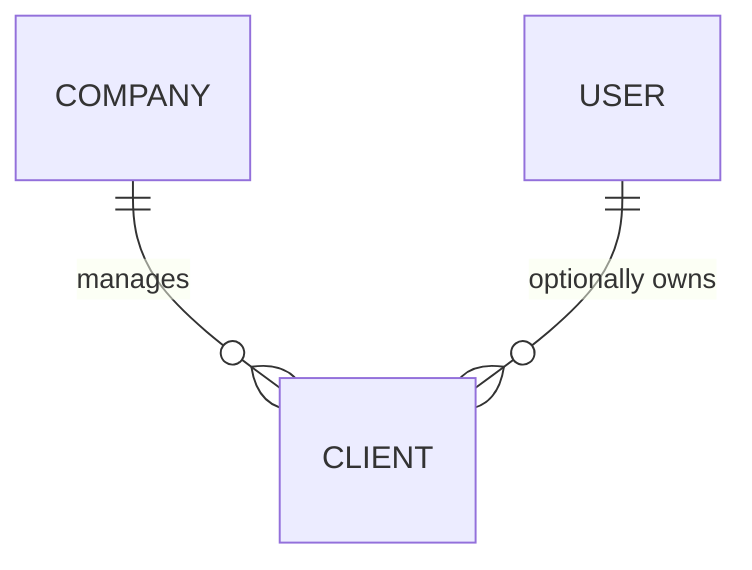

# ADR 001: Client Infrastructure

## Status
Accepted

## 1. Description
A **Client** is a system entity representing an individual who has either engaged in past transactions or is projected to perform future high-intent actions with the company. 

Clients are classified based on their relationship with the workforce:
- **Exclusive Clients:** Associated with a specific user (e.g., historical portfolio brought by an user upon onboarding). Leads originating from these clients are perpetually routed to the original user.
- **Company Clients:** Linked globally to the tenant without user-level exclusivity. These clients can be serviced by multiple users at different touchpoints, typically following a round-robin (roulette) distribution for new interactions.

**Business Consistency:** Clients must be unique within a single company. While the same individual (email) may exist across different tenants in the database, they cannot have duplicate records within the same `company_id`.

## 2. Technical Specification: Schema Design
Adhering to system-wide standards, the `clients` table will implement `SoftDeletes` and `ActivityLog`. It also integrates strictly with the multi-tenant scope.

- **Table: `clients`**
    - `id`: BigInt (Primary Key), Indexed.
    - `name`: String.
    - `email`: String (Unique per company), Indexed.
    - `phone`: String, Indexed.
    - `notes`: Text (For internal observations).
    - `user_id` (Nullable): Foreign Key referencing `users`. Indicates exclusivity.
    - `company_id` (Mandatory): Foreign Key referencing `companies`.
    - `address`: JSONB object containing `[country, state, city, neighborhood, street, number, complement, zip_code]`.
    - `profile_data`: JSONB object containing profiling metrics such as `[personal_income, family_income, purchase_intent, preferences]`.
    - `timestamps` & `soft_deletes`.

**Constraint:** A composite Unique Index must be defined on `(email, company_id)`.

## 3. Implementation (Laravel Standard)
- **Model:** `Client`
- **Traits:** `HasFactory`, `SoftDeletes`, `LogsActivity`.
- **Casts:** Both `address` and `profile_data` must be cast to `AsArrayObject` or `AsCollection` to facilitate fluent attribute manipulation.
- **Relationships:**
    - `company()`: `BelongsTo`
    - `user()`: `BelongsTo` (Optional/Nullable)

> [!NOTE]
> Ensure the inverse relationships (`clients(): HasMany`) are added to both `Company` and `User` models to maintain bidirectional traversability.

## 4. Recommended Test Scenarios (TDD)
- [ ] **Creation (Tenant):** Verify a client can be created when linked to a company without an assigned user.
- [ ] **Validation (Mandatory Tenant):** Ensure client creation fails if `company_id` is missing.
- [ ] **Creation (Exclusive):** Verify creation of an exclusive client linked to both a company and a user.
- [ ] **Integrity (Scoped Uniqueness):** Prevent the creation of duplicate emails within the same company.
- [ ] **Integrity (Cross-Tenant):** Confirm that the same email can exist in two different companies without conflict.
- [ ] **Observability:** Verify that an entry is recorded in the activity log upon every create/update event.

## 5. Seeders & Factories
To facilitate manual QA and UI demonstrations, local seed data is required. The implementation must include:

- Factories: Capable of generating both global (company-only) and exclusive (user-assigned) clients.

- Development Seeders: Prefixed with Dev (e.g., DevClientSeeder), these should populate the local environment with:

    - At least one Company Client (Shared/Global).

    - At least one Exclusive Client (Assigned to a specific user).

## 6. Visual Domain Modeling

