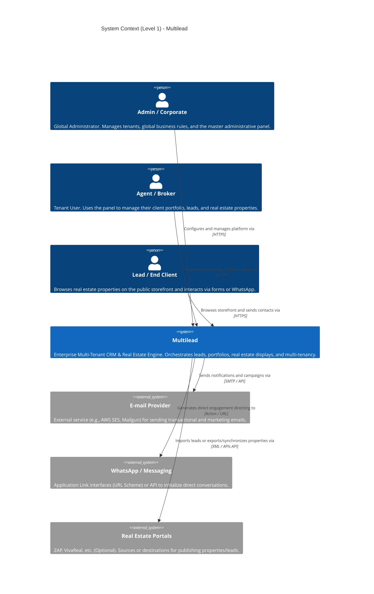

# C4 Model: Level 1 - System Context

This document provides the high-level context of the Multilead platform, mapping out the interactions between the various users (actors) and the external systems required for its operation.

