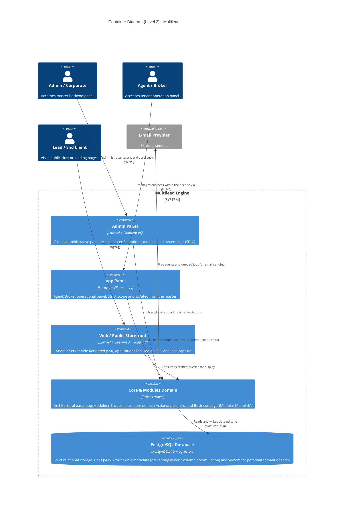

# C4 Model: Level 2 - Containers

This document dives deeper into the internal building blocks (Containers) of the Multilead platform, demonstrating the separation between the UI interfaces (App/Admin), the Core Modules, and the Database.

