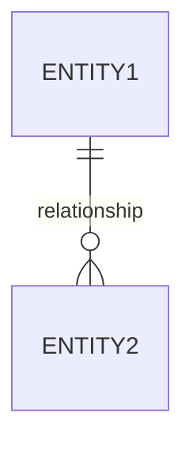

# Feature: [Feature Name]

## 0. Context & References
- **ADR Link:** [Link to related ADR]
- **Status:** [Draft | Approved | Implemented]
- **Stakeholders:** [Name of stakeholders]

## 1. Description
Brief summary of what the feature does and what is the value for the user (User Story).
*Example: As a broker, I want to convert a Lead into an Opportunity to start the sales process.*

## 2. Business Rules
- **BR01:** 

## 3. Technical Specification
- **Module Path:** `app/Modules/[ModuleName]/`
- **Affected Tables:** `table_name`
- **Models/Actions:** `ActionName::handle()`
- **UI Components Scope:** [Shared between Panels | Exclusive to {{Panel}}] (Mandatory: Specify if schemas should be global in `app/Filament/Schemas/` or local).

## 4. UI & Navigation (Filament)
- **Panel:** [App | Admin]
- **Navigation:** Group: [GroupName], Label: [Label], Icon: [Icon]
- **Resource Features:**
    - List: [Tabs, Filters, Table Columns]
    - View: [Infolists, Tabs, Widgets]
    - Form: [Modal or Screen, Layout]

## 5. Test Scenarios (TDD)
### Happy Path: [Scenario Name]
- **Given** [Precondition]
- **When** [Action]
- **Then** [Expectation]

> [!IMPORTANT]
> **Filament Testing Requirements:**
> All feature specifications MUST define test scenarios for Filament resources (forms, tables, actions, and tabs). These scenarios must be covered by Livewire/Filament feature tests.

## 6. Visual Domain Schema

## 7. Definition of Done (DoD)
- [ ] Feature documentation aligned with actual implementation.
- [ ] TDD: Feature tests covering all happy and failure paths.
- [ ] Logic implemented in Actions (if complex).
- [ ] Linting and formatting pass (Laravel Pint).
- [ ] Activity logs implemented for all CRUD/Actions.
- [ ] Project State updated.