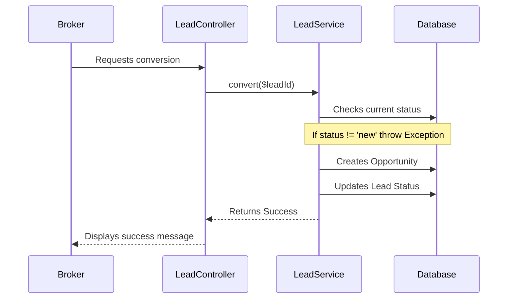

# Feature: [Feature Name]

## 1. Description
Brief summary of what the feature does and what is the value for the user (User Story).
*Example: As a broker, I want to convert a Lead into an Opportunity to start the sales process.*

## 2. Business Rules
- BR01: 

## 3. Technical Specification
- **Endpoint/Command:** `POST /api/leads/{id}/convert` or `LeadService->convert($lead)`
- **Expected Payload:** `{ "value": 150000, "close_date": "2026-12-31" }`
- **Affected Tables:** `opportunities`, `activities`.

## 4. Test Scenarios
### Happy Path: Successful Conversion
- **Given** that I have a lead with 'new' status
- **When** I execute the conversion action
- **Then** a record in the `opportunities` table must be created
- **And** the lead status must change to 'converted'

### Failure Scenario: Lead already converted
- **Given** a lead already has the 'converted' status
- **When** I try to convert again
- **Then** the system must return a 422 error (Unprocessable Entity)

