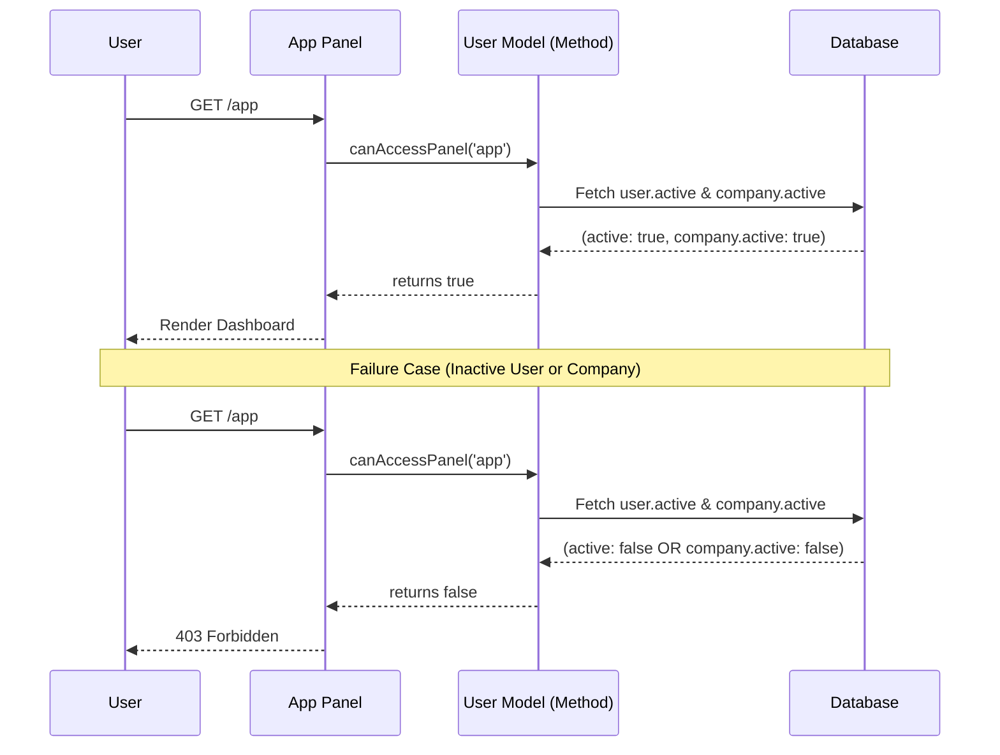

# Feature: App Panel Authentication

## 1. Description
As a User, I want to authenticate into the App Panel to manage my stuff. Access is contingent upon my personal status and my company's subscription status.

## 2. Business Rules
- **BR01 (User Status):** Access is granted only if `users.active` is `true`.
- **BR02 (Company Status):** Access is granted only if the related `companies.active` is `true`.

## 3. Technical Specification
### Infrastructure (Built-in)
- **Panel ID:** `app`
- **Guard:** `user`
- **URL Path:** `/app`

### Implementation (Custom)
- **Model:** `App\Models\User`
- **Hook:** `canAccessPanel(Panel $panel)`
- **Logic:** `return $this->active && $this->company?->active;` (Specifically for panel 'app').

## 4. Test Scenarios
### Scenario: Authorized Access
- **Given** a User with `active = true`
- **And** a Company with `active = true`
- **When** the User requests the `app` panel
- **Then** the system grants access (`200 OK`)

### Scenario: Denied by User Status
- **Given** a User with `active = false`
- **When** the User requests the `app` panel
- **Then** the system denies access (`403 Forbidden`)

### Scenario: Denied by Company Status
- **Given** a User with `active = true`
- **And** a Company with `active = false`
- **When** the User requests the `app` panel
- **Then** the system denies access (`403 Forbidden`)

