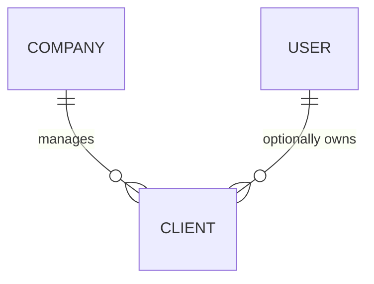

# Feature: Client Management & CRM

## 1. Description
A **Client** is a system entity representing an individual who has either engaged in past transactions or is projected to perform future high-intent actions with the company. Users need to manage both "Exclusive Clients" (their personal portfolio) and "Company Clients" (distributed globally by the tenant). This feature handles the lifecycle and data segregation of these profiles.

## 2. Business Rules
- **BR01 (Uniqueness):** A client's email must be unique within a single company (`company_id`). However, the same individual (email) can safely exist across different tenants.
- **BR02 (Exclusivity):** If a client has an assigned `user_id`, their classification as an "Exclusive Client" is subject to the `company` configuration. Depending on tenant-level settings, leads originating from these clients may either be perpetually routed to the linked user or follow standard distribution rules.
- **BR03 (Observability):** Any creation or update to a client record must be strictly registered via the `spatie/laravel-activitylog` package.

## 3. Technical Specification
- **Module Path:** `app/Modules/Clients/`
- **Model Hooks:** `Client` must use `HasFactory`, `SoftDeletes`, and `LogsActivity`.
- **Relationships:**
    - `company()`: `BelongsTo`
    - `user()`: `BelongsTo` (Nullable)
    - *(Note: Ensure the inverse relationship `clients(): HasMany` is added to both `Company` and `User` models).*
- **Database Schema (`clients` table):**
    - `id`: BigInt (PK)
    - `company_id`: Foreign Key (Mandatory)
    - `user_id`: Foreign Key (Nullable)
    - `name`, `email`, `phone`: Strings (Indexed)
    - `notes`: Text
    - `address`: JSONB object cast natively to `AsArrayObject` or `AsCollection` `[country, state, city, zip_code, etc]`.
    - `profile_data`: JSONB object cast natively `[personal_income, preferences, etc]`.
    - Constraints: A composite Unique Index must exist on `(email, company_id)`.

## 4. Test Scenarios (TDD)
### Scenario: Creation of a Tenant "Company Client"
- **Given** a valid payload linked to a `company_id` but missing a `user_id`
- **When** the creation logic is executed
- **Then** the client is saved as a Company Client
- **And** an activity log is stored associating the creation event

### Scenario: Creation of an "Exclusive Client"
- **Given** a valid payload with both `company_id` and `user_id`
- **When** the creation logic is executed
- **Then** the client is saved specifically bound to that user's portfolio

### Scenario: Constraint Failure on Scope Uniqueness
- **Given** an existing client with email `demo@example.com` in Company A
- **When** executing a creation command with `demo@example.com` for Company A
- **Then** the system must return a Validation Exception or Database Error

### Scenario: Cross-Tenant Schema Integrity
- **Given** an existing client with email `demo@example.com` in Company A
- **When** creating a client with `demo@example.com` in Company B
- **Then** the creation must succeed without conflict

## 5. Mocking Data (Seeders & Factories)
- **Factories:** Capable of generating both state variations (Global and Exclusive).
- **Development Seeders:** `DevClientSeeder` must populate the local environment with at least one Company Client and one Exclusive Client to assist in manual UI testing.

## 6. Visual Domain Schema

