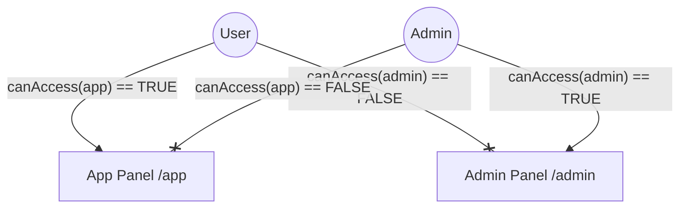

# Feature: Panel Isolation & Security

## 1. Description
To maintain absolute security and data integrity, users must be strictly isolated within their respective panels. A User should never reach the Admin Panel, and an Admin should be restricted from the App Panel unless explicitly permitted.

## 2. Business Rules
- **BR01 (Wall - Admin to App):** Administrators must not access the User's Application Panel to ensure independent testing/production environments (unless specifically allowed by the guard).
- **BR02 (Wall - User to Admin):** Users must never see the internal Corporate Management Panel.

## 3. Technical Specification
- **Implementation:** Custom logic in `canAccessPanel()` across different Authenticatable models.
- **Models involved:** `App\Models\User` (Users), `App\Models\Admin` (Admins).

## 4. Test Scenarios
### Scenario: App User trying to access Admin Panel
- **Given** a authenticated user in the `user` guard
- **When** they request any route under `/admin`
- **Then** the `canAccessPanel('admin')` returns `false`
- **And** the system returns `403 Forbidden`

### Scenario: Admin User trying to access App Panel
- **Given** a authenticated admin in the `admin` guard
- **When** they request any route under `/app`
- **Then** the `canAccessPanel('app')` should return `false` (currently needs review in `Admin.php`)
- **And** the system returns `403 Forbidden`

