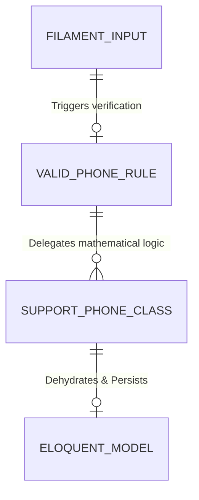

# Feature: Unified Phone Components

## 0. Context & References
- **ADR Link:** [ADR 016 - Phone Number Validation and Formatting Strategy](../adr/016-phone-formatting-validation.md)
- **Status:** Implemented
- **Stakeholders:** Development Team, Customer Success Team

## 1. Description
As a standardized platform requirement, we need a unified system to handle, validate, format, and render phone numbers robustly across the entire application ecosystem. This prevents fragmentation of database formats, guarantees the integrity of API payloads sent to third-party tools (like Zimobi or WhatsApp), and drastically improves UI consistency across both Admin and App visual panels.

## 2. Business Rules
- **BR01:** Any entity possessing a phone attribute must absolutely enforce the standard `ValidPhone` rule prior to database insertions to prevent broken formats.
- **BR02:** Non-digit payload symbols (like parenthesis, spaces, or hyphens) must be strictly discarded at the core validation level.
- **BR03:** Visual presentation blocks (Tables and Infolists) must natively parse stored integers into human-readable strings according to their inferred context (Brazil native formatting vs International prepending).
- **BR04:** All UI definitions for phones must utilize the centralized Filament components to avoid code duplication and isolated legacy implementations.

## 3. Technical Specification
- **Module Path:** `app/Support/`, `app/Filament/CustomComponents/`, `app/Rules/`
- **Affected Tables:** N/A (Applies to any model with phone columns e.g. `clients`, `users`)
- **Models/Actions:** `App\Support\Phone::class`
- **UI Components Scope:** **Shared between Panels** (Mandatory: Specify if schemas should be global in `app/Filament/Schemas/` or local).

### Implementation Directives
1. **Support Domain (`App\Support\Phone`)**: Develop parsing algorithms to detect, strip, and mutate logic distinguishing between Brazilian numbers (8-13 digits, respecting DDI '55') and International numbers (>=8 digits ignoring standard constraints).
2. **Validator Adapter (`App\Rules\ValidPhone`)**: Implement a generic Laravel Validation rule that binds to the Phone domain utility.
3. **Custom Schemas**: Construct `PhoneInput` (for creating/editing records enforcing the mask natively on frontend input mechanisms), `PhoneColumn` (for table data grids supporting instant clip-boarding), and `PhoneEntry` (for static Infolist rendering).

## 4. Application Vectors
- **Implementation:** Core domain utilities (`App\Support\Phone`) and UI formatting elements.
- **Goal:** Rather than relying on isolated Filament validations, this feature centralizes logic so any entry point (Forms, APIs, CLI commands) uses the same strict mathematical validation rules. Filament components simply act as consumers of this domain logic.

## 5. Test Scenarios (TDD)
### Scenario 1: Local & Regional Brazilian Numbers
- **Given** a 8 or 9-digit local phone number, or a 10 or 11-digit regional number with DDD.
- **When** passed through `Phone::isValid()`.
- **Then** the engine should recognize it as a valid Brazilian array and return `true`.

### Scenario 2: Strict Brazilian Regex Rules
- **Given** a 8 or 9-digit Brazilian number (after stripping DDI/DDD if present).
- **When** passed through `Phone::isValid()`.
- **Then** if it is a 9-digit number, it MUST start with `9`. If it is an 8-digit number, it MUST NOT start with `9`.

### Scenario 3: Long Format DDI Boundaries (Brazilian vs International)
- **Given** a >= 12 digit number.
- **When** passing it through the validation engine.
- **Then** if it starts with the default DDI (`55`), it is evaluated strictly as a Brazilian number. If it does not start with `55`, it is evaluated as a valid International number and allowed through.

### Scenario 4: Below Threshold & Garbage Inputs
- **Given** a 7-digit number or a string filled with letters (`"abc-1234"`).
- **When** passed through `Phone::isValid()`.
- **Then** it must automatically fail validation due to insufficient minimum integer length (>= 8).

### Scenario 4: Validation Rule Adapter Testing
- **Given** an HTTP Post request payload directed at a database mutation.
- **When** the payload relies on the `ValidPhone` rule.
- **Then** any mismatch in the above mathematical constraints instantly triggers the standard Laravel validation exception ('The provided phone is invalid.').

> [!IMPORTANT]
> **Filament Testing Requirements:**
> All feature specifications MUST define test scenarios for Filament resources (forms, tables, actions, and tabs). These scenarios must be covered by Livewire/Filament feature tests.

## 6. Visual Domain Schema

## 7. Definition of Done (DoD)
- [x] Core `App\Support\Phone` mathematically handles all character stripping and size logic correctly.
- [x] Adaptive Validation Rule (`ValidPhone`) successfully consumes the custom Support limits.
- [x] Dedicated Unit/Feature tests written to forcefully attempt local, garbage, and long-international inputs into the Validator directly.
- [x] Centralized Custom Schemas (`PhoneInput`, etc.) created pointing to this engine.
- [x] Project State updated.
