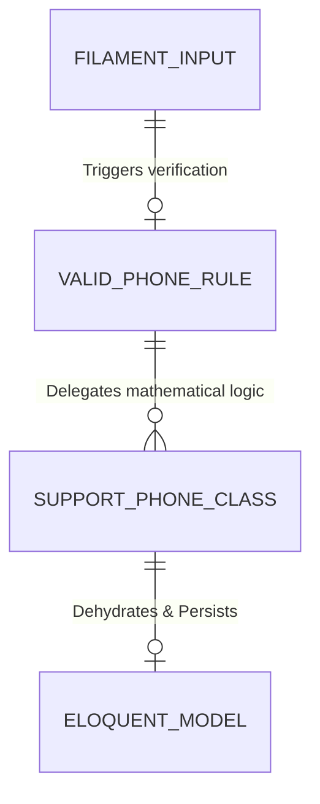

# Feature: Unified Phone Components

## 0. Context & References
- **ADR Link:** [ADR 016 - Phone Number Validation and Formatting Strategy](../adr/016-phone-formatting-validation.md)
- **Status:** Draft
- **Stakeholders:** Development Team, Customer Success Team

## 1. Description
As a standardized platform requirement, we need a unified system to handle, validate, format, and render phone numbers robustly across the entire application ecosystem. This prevents fragmentation of database formats, guarantees the integrity of API payloads sent to third-party tools (like Zimobi or WhatsApp), and drastically improves UI consistency across both Admin and App visual panels.

## 2. Business Rules
- **BR01:** Any entity possessing a phone attribute must absolutely enforce the standard `ValidPhone` rule prior to database insertions to prevent broken formats.
- **BR02:** Non-digit payload symbols (like parenthesis, spaces, or hyphens) must be strictly discarded at the core validation level.
- **BR03:** Visual presentation blocks (Tables and Infolists) must natively parse stored integers into human-readable strings according to their inferred context (Brazil native formatting vs International prepending).
- **BR04:** All UI definitions for phones must utilize the centralized Filament components to avoid code duplication and isolated legacy implementations.

## 3. Technical Specification
- **Module Path:** `app/Support/`, `app/Filament/CustomComponents/`, `app/Rules/`
- **Affected Tables:** N/A (Applies to any model with phone columns e.g. `clients`, `users`)
- **Models/Actions:** `App\Support\Phone::class`
- **UI Components Scope:** **Shared between Panels** (Mandatory: Specify if schemas should be global in `app/Filament/Schemas/` or local).

### Implementation Directives
1. **Support Domain (`App\Support\Phone`)**: Develop parsing algorithms to detect, strip, and mutate logic distinguishing between Brazilian numbers (8-13 digits, respecting DDI '55') and International numbers (>=8 digits ignoring standard constraints).
2. **Validator Adapter (`App\Rules\ValidPhone`)**: Implement a generic Laravel Validation rule that binds to the Phone domain utility.
3. **Custom Schemas**: Construct `PhoneInput` (for creating/editing records enforcing the mask natively on frontend input mechanisms), `PhoneColumn` (for table data grids supporting instant clip-boarding), and `PhoneEntry` (for static Infolist rendering).

## 4. UI & Navigation (Filament)
- **Panel:** App & Admin (Accessible contextually)
- **Navigation:** Group: N/A, Label: N/A, Icon: N/A
- **Resource Features:**
    - List: Implement visual danger blocks if an invalid legacy phone string sneaks into the parser flow.
    - View: Expose the `+55 (XX) XXXXX-XXXX` human template visually.
    - Form: Guarantee the backend parses and `dehydrate` operations compress input before yielding control back to Eloquent.

## 5. Test Scenarios (TDD)
### Happy Path: Local Scope Inflation
- **Given** an agent attempts to save a new record inputting a local 9-digit number.
- **When** the custom forms invoke the backend dehydrate operation.
- **Then** the database automatically captures the `55` DDI + local `DDD` enforcing the regional data norm.

### Error Path: Impossible Format Capture
- **Given** an agent types an incomplete 5-digit number into the `PhoneInput`.
- **When** the form submits a POST payload for creation context.
- **Then** the request triggers the standard Laravel validation loop mapped to `ValidPhone` rule, returning an explicit localized failure message and halting eloquent persistency.

> [!IMPORTANT]
> **Filament Testing Requirements:**
> All feature specifications MUST define test scenarios for Filament resources (forms, tables, actions, and tabs). These scenarios must be covered by Livewire/Filament feature tests.

## 6. Visual Domain Schema

## 7. Definition of Done (DoD)
- [ ] Feature documentation aligned with actual implementation.
- [ ] TDD: Feature tests covering all happy and failure paths.
- [ ] Logic implemented in Actions (if complex).
- [ ] Linting and formatting pass (Laravel Pint).
- [ ] Activity logs implemented for all CRUD/Actions.
- [ ] Project State updated.
