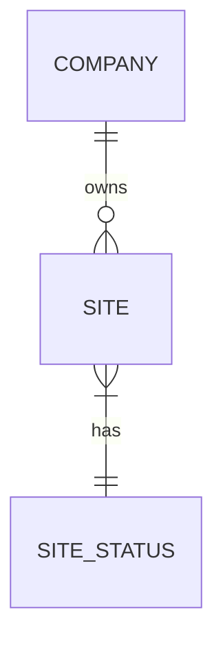

# Feature: Site Management

## 0. Context & References
- **ADR Link:** [ADR 004: Site Provisioning and Management Boundaries](../adr/004-site-provisioning-boundaries.md)
- **Status:** Approved
- **Stakeholders:** Platform Admins (Provisioning), Tenants (Management)

## 1. Description
A **Site** represents an external-facing digital asset for a client (Tenant). This feature centralizes the configuration of the site's identity, SEO, scripts (Analytics/Pixel), and SMTP credentials. The system is designed to handle both single-site tenants and multi-site agencies seamlessly.

## 2. Business Rules
- **BR01 (Provisioning):** Only Platform Administrators (Admin Panel) can create or delete a Site.
- **BR02 (Shared Management):** Once created, a Site's details can be edited by the tenant (App Panel) or Platform Administrators.
- **BR03 (Observability):** All changes to sensitive data (SMTP, Scripts) must be logged via `spatie/laravel-activitylog`.
- **BR04 (Unitary vs. Multiple Sites UI):**
    - **Single Site:** The navigation points directly to the Edit page, labeled "Settings".
    - **Multiple Sites:** The navigation points to an Index list, labeled "My Sites".
- **BR05 (Data Isolation):** A tenant can only view/edit sites belonging to their `Company`.
- **BR06 (Status Transitions):**
    - Tenants (App Panel) can freely move a site between `Development`, `Production`, and `Maintenance`.
    - If a site is `Inactive`, it becomes read-only for the tenant; they cannot change its status.
    - Tenants cannot move a site TO `Inactive`.
    - Only Platform Administrators (Admin Panel) can set a site to `Inactive` or reactivate it.

## 3. Technical Specification
- **Module Path:** `app/Modules/Websites/`
- **Model:** `Site` (Uses `HasFactory`, `SoftDeletes`, `LogsActivity`)
- **UI Components Scope:** Shared via [SiteForm](../../app/Filament/Schemas/SiteForm.php).

### Database Schema Highlights (`sites` table):
- `id`: BigInt (PK)
- `company_id`: Foreign Key (Mandatory)
- `name`: String
- `status`: Enum (`SiteStatus`)
    - `Development`: Accessible only via test URL.
    - `Production`: Fully accessible on client's domain and test URL.
    - `Maintenance`: Accessible, but displays a "Maintenance" notification to visitors.
    - `Inactive`: Completely inaccessible to external traffic.
- `visual_settings`: JSON (Themes, colors)
- `default_meta_title`, `default_meta_description`, `default_meta_keywords`: Strings/Text (SEO defaults)
- `canonical_url`: String (Primary domain, auto-formatted)
- `scripts_header`, `scripts_body`, `scripts_footer`: Text (Analytics/Pixel injection)
- `mail_default_recipient`, `mail_from_address`, `mail_from_name`: Strings (Default senders/recipients)
- `smtp_host`, `smtp_port`, `smtp_username`, `smtp_password`, `smtp_encryption`: Strings/Numeric (SMTP data, password encrypted)
- `privacy_policy_text`: LongText (Rich text for Legal terms)

> [!NOTE]
> Advanced features like **Banners**, **Posts**, and **Site Categories** (General taxonomies) are part of the extended Website ecosystem and documented in their own feature specs. For now, the Site acts as the root container for these future entities.

## 4. UI & Navigation (Filament)

### App Panel (Tenant Context)
- **Navigation:**
    - **Group:** "Site" (if 1 site) or "Sites" (if multiple)
    - **Label:** Dynamic ("Site Settings" or "My Sites")
    - **Icon:** `heroicon-o-globe-alt`
- **Behavior:**
    - If the tenant has exactly one site, the menu item links directly to the **Edit** page.
    - If the tenant has multiple sites, the menu item links to the **List** page.

### Admin Panel (Platform Context)
- **Navigation:** Managed via `RelationManager` inside the [CompaniesResource](../../app/Filament/AdminPanel/Resources/Companies/CompaniesResource.php).
- **Access:** Direct CRUD access for Platform Admins.

### Form Layout (Tabs)
The [SiteForm](../../app/Filament/Schemas/SiteForm.php) is organized into:
1.  **General:** Name and Status.
2.  **SEO:** Meta Titles, Descriptions, and Canonical URL.
3.  **Scripts:** Header, Body, and Footer injection points.
4.  **Mail Configuration:** SMTP and Sender details.
5.  **Legal:** Privacy Policy text (Rich Editor).

## 5. Test Scenarios (TDD)

### Happy Path: Navigation Redirection (App Panel)
- **Given** an authenticated tenant with exactly one site
- **When** the user clicks the "Settings" menu item
- **Then** they must be redirected directly to the Edit form for that site

### Happy Path: Site Update (App Panel)
- **Given** an existing site
- **When** the tenant updates the `canonical_url` or `smtp_password`
- **Then** the `canonical_url` must be auto-formatted correctly
- **And** the `smtp_password` must be stored encrypted
- **And** an Activity Log must be recorded

### Failure Scenario: Unauthorized Access
- **Given** Tenant A attempts to access the Edit URL of a site belonging to Tenant B
- **Then** the system must return a 403 Forbidden or 404 Not Found error (scoped by tenant)

### Failure Scenario: Creation in App Panel
- **Given** an authenticated tenant in the App Panel
- **When** they attempt to access the `sites/create` route
- **Then** the `SitePolicy` must deny access (BR01)

### Failure Scenario: Deletion in App Panel
- **Given** an existing site belonging to the tenant's company
- **When** the tenant attempts to trigger a DeleteAction in the App Panel
- **Then** the `SitePolicy` must deny access (BR01)
- **And** the Delete button must not be visible in the UI
### Failure Scenario: Unauthorized Status Change (App Panel)
- **Given** an existing site with status `Inactive`
- **When** the tenant attempts to change the status to `Production` in the App Panel
- **Then** the status field must be disabled or the update must be denied (BR06)

### Failure Scenario: Attempting to Inactivate Site (App Panel)
- **Given** an existing site with status `Production`
- **When** the tenant attempts to change the status to `Inactive`
- **Then** the `Inactive` option must not be available in the dropdown (BR06)

## 6. Visual Domain Schema

## 7. Definition of Done (DoD)
- [ ] Feature documentation aligned with actual implementation.
- [ ] TDD: Feature tests covering navigation redirection and policy restrictions.
- [ ] Canonical URL auto-formatting logic implemented in Schema.
- [ ] SMTP Password encryption verified.
- [ ] Activity logs verified for sensitive updates.
- [ ] Multi-tenancy scoping enforced in `AppPanel`.
