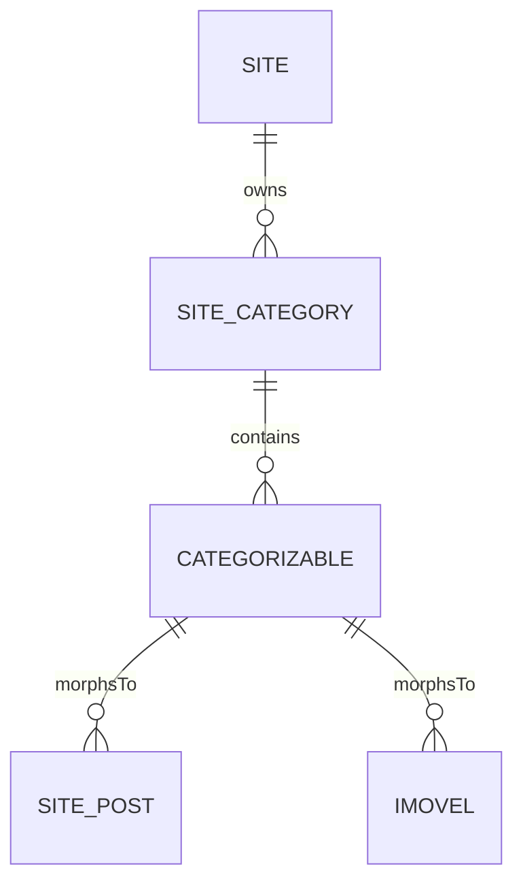

# Feature: Site Categories

## 0. Context & References
- **ADR Link:** [ADR 005: Generic Categorizable Architecture](file:///Users/thiagocardoso/projetos/www/multilead/docs/adr/005-generic-categorizable-system.md)
- **Status:** Approved
- **Stakeholders:** Developers, Product Owners

## 1. Description
A **Site Category** acts as a structural tag or universal taxonomy for grouping content on a client's website. By utilizing a polymorphic architecture, a single category can group distinct items together (e.g., categorizing both a Blog Post and a Property under the same "Luxury" umbrella). 

As a site administrator, I want to manage a centralized taxonomy so I can keep my website content organized across different domains (Blog, Properties, etc.) without duplicating category names.

## 2. Business Rules
- **BR01 (Ownership):** A Category must be unique and bound to a specific `Site`.
- **BR02 (Typing):** A Category has a `type` definition (e.g., `general`, `post`, `property`).
- **BR03 (UI Filtering):** If type is `post`, it should only be available in UI dropdowns related to Site Posts. If `general`, it can tag any entity.
- **BR04 (Polymorphism):** Relationships are managed via the `site_categorizables` table, supporting cross-domain tagging.
- **BR05 (SEO Support):** Categories hold independent SEO configurations (`seo_settings`) and support custom scripts.
- **BR06 (Observability):** All CRUD operations on Categories must be logged via `spatie/laravel-activitylog` scoped to the tenant.

## 3. Technical Specification
- **Module Path:** `app/Modules/Websites/`
- **Affected Tables:** `site_categories`, `site_categorizables`
- **Models:** `SiteCategory` model (uses `CategoryType` enum for `type` cast).
- **Core Enum:** `CategoryType` (`General`, `Post`, `Property`) implements `HasLabel` and `HasColor`.
- **UI Components Scope:** Exclusive to **App Panel**. Local schemas stored in `app/Filament/App/Resources/SiteCategoryResource/Schemas/`.

## 4. UI & Navigation (Filament)
- **Panel:** App (Corporate/Agent side)
- **Navigation:** Group: `Websites`, Label: `Categories`, Icon: `heroicon-o-tag`
- **Resource Features:**
    - **List:**
        - Columns: `name`, `type` (**Badge mapped from Enum color**), `description`.
        - **Tabs Filter:** The top of the list must contain tabs for filtering by `CategoryType` cases.
    - **Form:** 
        - **Modal-based Layout:** All creation and editing must occur within a modal (`--simple` resource pattern).
    - **Actions:** 
        - Table actions (Edit, Delete) must be wrapped in an `ActionGroup` to maintain UI consistency.

## 5. Test Scenarios (TDD)
### Happy Path: Category CRUD via Filament
- **Given** I am an authenticated user on the App Panel
- **When** I open the "Categories" resource
- **Then** I should see the tabs for filtering by type
- **When** I click "Create" and fill the modal
- **Then** a new `SiteCategory` should be created and visible in the list

### Type-specific Filtering
- **Given** existing categories of types `post` and `property`
- **When** I click on the "Post" tab
- **Then** I should only see categories with type `post`

> [!IMPORTANT]
> **Filament Testing Requirements:**
> All UI features must be covered by Livewire/Filament feature tests mocking a specific Site context.

## 6. Visual Domain Schema

## 7. Definition of Done (DoD)
- [ ] Feature documentation aligned with actual implementation.
- [ ] TDD: Feature tests covering Filament list, tabs, and modal actions.
- [ ] `php artisan make:filament-resource SiteCategory --simple` executed.
- [ ] Activity logs implemented.
- [ ] Linting pass with Laravel Pint.
