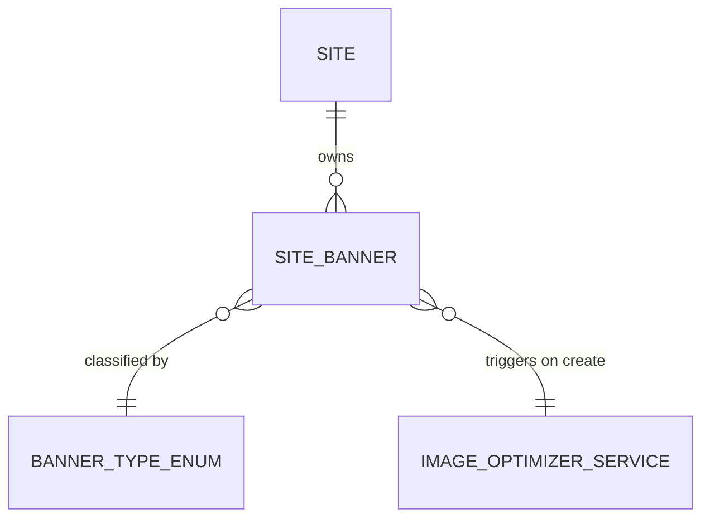

# Feature: Site Banners

## 0. Context & References
- **ADR Link:** [ADR 006: Banner System Architecture](../adr/006-banner-system-architecture.md)
- **ADR Link:** [ADR 017: Image Optimization Service](../adr/017-image-optimizer-service.md)
- **Status:** Implemented (Migrations)
- **Stakeholders:** Tenants (Management per Site)

## 1. Description
A **Site Banner** represents a visual asset (image) and call-to-action (link/button) displayed on a website. Banners are classified by a `BannerType` enum that defines their behavioral purpose — such as a general static image, an entry popup, or an exit intent overlay. This allows clients to manage dynamic promotional content without modifying source code.

## 2. Business Rules
- **BR01 (Type Classification):** A Banner must have a `type` from the `BannerType` enum. Defaults to `general`.
- **BR02 (Expirability):** Banners can optionally have a `display_until` date. Once this date passes, the system must logically hide the banner from front-end API responses without physically deleting the record.
- **BR03 (Observability):** Changes to banners (especially swapping images or changing target links) must be logged via `spatie/laravel-activitylog` mapped to the tenant Company.
- **BR04 (Image Storage - Relative Only):** Database records MUST NOT store absolute paths. Only the filename (hash) is persisted.
- **BR05 (Mandatory Data):** ONLY the `image_path` (image file) is mandatory for banner creation. All other fields (title, description, link) are optional.
- **BR06 (Strict Media Policy):** Only `image/png` and `image/jpeg` MIME types are accepted. Rejection must happen before processing.

## 3. Technical Specification
- **Module Path:** `app/Modules/Websites/`
- **Affected Tables:** `site_banners`
- **Enum:** `App\Enums\BannerType` (Backed Enum — values: `general`, `entry_popup`, `exit_intent`)
- **Models/Actions:** `SiteBanner` uses `HasFactory`, `SoftDeletes`, and `LogsActivity`.
- **Observer:** `SiteBannerObserver` — on `created`, dispatches `ImageOptimizationRequested` event.
- **UI Components Scope:** Local to the App Panel, within the `WebsitesCluster`.
- **Resource Type:** Simple resource (modal-based CRUD — `--simple`).
- **Database Schema (`site_banners` table):**
    - `id`, `site_id` (FK)
    - `type`: Enum cast to `BannerType`
    - `title`: String (required)
    - `description`: Text (optional)
    - `image_path`: String (required)
    - `link_url`: String (optional)
    - `action_label`: String (optional)
    - `display_until`: DateTime (nullable)

## 4. UI & Navigation (Filament)
- **Panel:** App
- **Navigation:**
    - **Cluster:** `WebsitesCluster`
    - **Group:** `Websites`
    - **Label:** `Banners`
    - **Icon:** `heroicon-o-photo`
- **Resource Features:**
    - **List View (Tabs by Type):**
        - **"All":** Default tab — shows all banners for the active site.
        - **"General":** Filters by `BannerType::General`.
        - **"Entry Popup":** Filters by `BannerType::EntryPopup`.
        - **"Exit Intent":** Filters by `BannerType::ExitIntent`.
    - **Relationships:**
    - `type()`: `BelongsTo` `BannerType`
- **Dynamic Path Resolution:** The `SiteBanner` model must implement a virtual attribute (e.g., `full_url` or `storage_path`) that dynamically prepends the tenant-specific directory context `{company_id}/{site_id}/banners/` to the stored `image_path` (filename) using the application's storage configuration.
    - **Form (Modal):**
        - `type`: Select from `BannerType` enum (required)
        - `title`: Text input (required)
        - `description`: Textarea (optional)
        - `image_path`: File upload — accepts PNG and JPG only (required)
        - `link_url`: URL input (optional)
        - `action_label`: Text input (optional, e.g. "Click Here")
        - `display_until`: Date/time picker (optional)

## 5. Test Scenarios (TDD)
### Happy Path: Adding a new Banner (Minimal Data)
- **Given** an active site
- **When** a user uploads a valid PNG/JPG image and saves WITHOUT title or description
- **Then** the record is created successfully (only image is mandatory)

### Happy Path: Isolation (Multi-tenant)
- **Given** banners exist in Company A and Company B
- **When** a user from Company A logs into the App Panel
- **Then** they MUST ONLY see banners belonging to Company A sites
- **And** any attempt to access a banner ID from Company B via URL/API must be denied (404/403)

### Failure Scenario: Strict Media Policy
- **Given** a user attempts to upload a `.gif` or `.webp` file
- **When** the form is submitted
- **Then** validation must reject the file (Policy: only PNG/JPG allowed)

> [!IMPORTANT]
> **Filament Testing Requirements:**
> All feature specifications MUST define test scenarios for Filament resources (forms, tables, actions, and tabs). These scenarios must be covered by Livewire/Filament feature tests.

## 6. Visual Domain Schema

## 7. Definition of Done (DoD)
- [x] Feature documentation aligned with actual implementation.
- [ ] `BannerType` enum created at `app/Enums/BannerType.php`.
- [ ] `site_banners` table includes `type` column cast to `BannerType`.
- [ ] TDD: Feature tests covering all happy and failure paths.
- [ ] `SiteBannerObserver` implemented and registered.
- [ ] `ImageOptimizationRequested` event + `OptimizeImageJob` created.
- [ ] Image stored under `{company_id}/{site_id}/banners/` with correct naming.
- [ ] Linting and formatting pass (Laravel Pint).
- [ ] Activity logs implemented for all CRUD/Actions.
- [ ] Project State updated.
