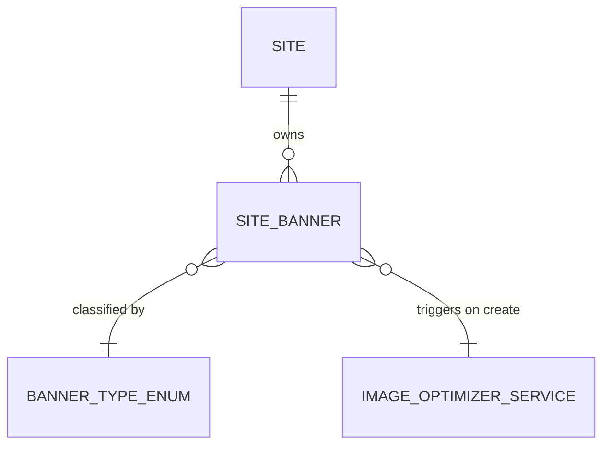

# Feature: Site Banners

## 0. Context & References
- **ADR Link:** [ADR 006: Banner System Architecture](../adr/006-banner-system-architecture.md)
- **ADR Link:** [ADR 017: Image Optimization Service](../adr/017-image-optimizer-service.md)
- **Status:** Implemented (Migrations)
- **Stakeholders:** Tenants (Management per Site)

## 1. Description
A **Site Banner** represents a visual asset (image) and call-to-action (link/button) displayed on a website. Banners are classified by a `BannerType` enum that defines their behavioral purpose — such as a general static image, an entry popup, or an exit intent overlay. This allows clients to manage dynamic promotional content without modifying source code.

## 2. Business Rules
- **BR01 (Type Classification):** A Banner must have a `type` from the `BannerType` enum. The type determines how the front-end renders and triggers the banner:
    - **`general`:** Static banner displayed in a fixed layout position. No behavioral trigger.
    - **`entry_popup`:** Modal shown immediately when the user loads the site.
    - **`exit_intent`:** Modal triggered when the user's cursor moves toward the browser chrome (intent to leave).
- **BR02 (Expirability):** Banners can optionally have a `display_until` date. Once this date passes, the system must logically hide the banner from front-end API responses without physically deleting the record.
- **BR03 (Observability):** Changes to banners (especially swapping images or changing target links) must be logged via `spatie/laravel-activitylog` mapped to the tenant Company.
- **BR04 (Image Storage):** Banner images are stored locally. The path structure is: `{company_id}/{site_id}/banners/{hash}-{site_id}-{company_id}.{ext}`. Accepted formats: PNG and JPG only.
- **BR05 (Image Optimization):** On creation, a Model Observer dispatches an `ImageOptimizationRequested` event that triggers the `ImageOptimizerService` asynchronously. See ADR 017 for rules.
- **BR06 (Accepted Formats):** Only PNG and JPG files are accepted for upload. Any other format must be rejected at validation time.

## 3. Technical Specification
- **Module Path:** `app/Modules/Websites/`
- **Affected Tables:** `site_banners`
- **Enum:** `App\Enums\BannerType` (Backed Enum — values: `general`, `entry_popup`, `exit_intent`)
- **Models/Actions:** `SiteBanner` uses `HasFactory`, `SoftDeletes`, and `LogsActivity`.
- **Observer:** `SiteBannerObserver` — on `created`, dispatches `ImageOptimizationRequested` event.
- **UI Components Scope:** Local to the App Panel, within the `WebsitesCluster`.
- **Resource Type:** Simple resource (modal-based CRUD — `--simple`).
- **Database Schema (`site_banners` table):**
    - `id`, `site_id` (FK)
    - `type`: Enum cast to `BannerType`
    - `title`: String (required)
    - `description`: Text (optional)
    - `image_path`: String (required)
    - `link_url`: String (optional)
    - `action_label`: String (optional)
    - `display_until`: DateTime (nullable)

## 4. UI & Navigation (Filament)
- **Panel:** App
- **Navigation:**
    - **Cluster:** `WebsitesCluster`
    - **Group:** `Websites`
    - **Label:** `Banners`
    - **Icon:** `heroicon-o-photo`
- **Resource Features:**
    - **List View (Tabs by Type):**
        - **"All":** Default tab — shows all banners for the active site.
        - **"General":** Filters by `BannerType::General`.
        - **"Entry Popup":** Filters by `BannerType::EntryPopup`.
        - **"Exit Intent":** Filters by `BannerType::ExitIntent`.
    - **Form (Modal):**
        - `type`: Select from `BannerType` enum (required)
        - `title`: Text input (required)
        - `description`: Textarea (optional)
        - `image_path`: File upload — accepts PNG and JPG only (required)
        - `link_url`: URL input (optional)
        - `action_label`: Text input (optional, e.g. "Click Here")
        - `display_until`: Date/time picker (optional)

## 5. Test Scenarios (TDD)
### Happy Path: Adding a new Banner
- **Given** an active site belonging to a Company
- **When** a user opens the creation modal, selects type "Entry Popup", uploads a PNG/JPG image, and saves
- **Then** the `site_banners` table reflects the new record with `type = entry_popup`
- **And** the image is stored under `{company_id}/{site_id}/banners/`
- **And** an `ImageOptimizationRequested` event is dispatched
- **And** the activity log registers the upload event

### Happy Path: Filtering by Type Tab
- **Given** banners of type "General" and "Entry Popup" exist on the site
- **When** the user clicks the "Entry Popup" tab in the Banner list
- **Then** the table must only show banners with `type = entry_popup`

### Failure Scenario: Expired Banner Excluded from API
- **Given** a Banner with a `display_until` date in the past
- **When** the front-end queries active banners of that type
- **Then** the expired Banner is excluded from the returned collection

### Failure Scenario: Invalid File Format
- **Given** a user attempts to upload a `.webp` or `.gif` file
- **When** the upload form is submitted
- **Then** validation must reject the file with an appropriate error message

> [!IMPORTANT]
> **Filament Testing Requirements:**
> All feature specifications MUST define test scenarios for Filament resources (forms, tables, actions, and tabs). These scenarios must be covered by Livewire/Filament feature tests.

## 6. Visual Domain Schema

## 7. Definition of Done (DoD)
- [x] Feature documentation aligned with actual implementation.
- [ ] `BannerType` enum created at `app/Enums/BannerType.php`.
- [ ] `site_banners` table includes `type` column cast to `BannerType`.
- [ ] TDD: Feature tests covering all happy and failure paths.
- [ ] `SiteBannerObserver` implemented and registered.
- [ ] `ImageOptimizationRequested` event + `OptimizeImageJob` created.
- [ ] Image stored under `{company_id}/{site_id}/banners/` with correct naming.
- [ ] Linting and formatting pass (Laravel Pint).
- [ ] Activity logs implemented for all CRUD/Actions.
- [ ] Project State updated.
