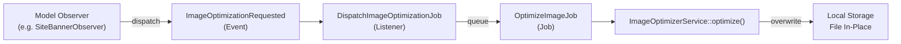

# Feature: Image Optimizer Service

## 0. Context & References
- **ADR Link:** [ADR 017: Image Optimization Service](../adr/017-image-optimizer-service.md)
- **Status:** Draft
- **Stakeholders:** Platform (Infrastructure), Websites Module (Banners)

## 1. Description
The **Image Optimizer Service** is a centralized, cross-cutting infrastructure component responsible for optimizing uploaded images across all modules that require it. It ensures consistent storage size, image quality, and naming conventions throughout the platform, without blocking the user's HTTP request.

As a tenant uploads a banner image, the service runs asynchronously in the background: resizing if needed, compressing with subtle quality loss, and overwriting the original file in-place.

## 2. Business Rules
- **BR01 (Max Dimensions):** The optimized image must never exceed **2560px** in either width or height. If larger, it is resized proportionally preserving aspect ratio.
- **BR02 (Compression):** Images are compressed with subtle quality loss — targeting ~85% quality for JPEG and ~75% compression level for PNG — to minimize storage without visible degradation.
- **BR03 (Format Preservation):** The optimizer preserves the original format. PNG stays PNG, JPG stays JPG. No format conversion.
- **BR04 (Accepted Formats):** Only **PNG** and **JPG** are accepted. Any other format must be rejected by the consuming module's validation before reaching the optimizer.
- **BR05 (In-Place Replacement):** The optimized output overwrites the original file at the same storage path. No copies or variants are created.
- **BR06 (Naming Convention):** The consuming module is responsible for generating the filename before upload. The format must be: `{unique_hash}-{site_id}-{company_id}.{ext}`. The optimizer does not rename files.
- **BR07 (Async Execution):** Optimization is always dispatched as a queued job. The HTTP response is never blocked by processing.

## 3. Technical Specification
- **Module Path:** `app/Core/Services/ImageOptimizerService.php`
- **Job:** `app/Jobs/OptimizeImageJob.php`
- **Event:** `app/Events/ImageOptimizationRequested.php`
- **Listener:** `app/Listeners/DispatchImageOptimizationJob.php`
- **UI Components Scope:** None — infrastructure only.

### Integration Flow
```
[Model Created]
     → [Observer] dispatches ImageOptimizationRequested($filePath)
           → [Listener] dispatches OptimizeImageJob($filePath)
                 → [Job] calls ImageOptimizerService::optimize($filePath)
                       → [Result] file overwritten in-place
```

### Module Integration Contract
Any module integrating with this service must:
1. Validate the file format (PNG/JPG) **before** upload persists.
2. Generate the filename following `{hash}-{site_id}-{company_id}.{ext}`.
3. Register a Model Observer that dispatches `ImageOptimizationRequested` on `created`.

## 4. UI & Navigation (Filament)
- **Panel:** None.
- No UI is exposed for this service. It is a background infrastructure concern.

## 5. Test Scenarios (TDD)
### Happy Path: Image resized and compressed on creation
- **Given** a `SiteBanner` is created with a JPG image of 4000x2000px
- **When** the `SiteBannerObserver` fires the `ImageOptimizationRequested` event
- **Then** the `OptimizeImageJob` executes
- **And** the resulting file dimensions must be ≤ 2560px on the longest edge
- **And** the file size must be smaller than the original
- **And** the file must exist at the same path (in-place replacement)

### Happy Path: Small image passes through unchanged dimensions
- **Given** a JPG image of 800x600px (within the size limit)
- **When** the optimizer processes it
- **Then** the image dimensions are unchanged
- **And** only compression is applied

### Failure Scenario: Service skips unsupported format
- **Given** a file path pointing to a `.webp` or `.gif` file
- **When** `ImageOptimizerService::optimize()` is called
- **Then** it must throw an exception or silently skip, logging a warning

> [!IMPORTANT]
> **Filament Testing Requirements:**
> This service has no Filament UI, but the integration must be tested via Feature Tests that assert the event is dispatched when a consuming model (e.g., `SiteBanner`) is created.

## 6. Visual Domain Schema


## 7. Definition of Done (DoD)
- [ ] Feature documentation aligned with actual implementation.
- [ ] TDD: Feature tests asserting event dispatch and file optimization result.
- [ ] `ImageOptimizerService` implemented in `app/Core/Services/`.
- [ ] `ImageOptimizationRequested` event created.
- [ ] `DispatchImageOptimizationJob` listener registered.
- [ ] `OptimizeImageJob` queued job created.
- [ ] Integration tested via `SiteBannerObserver`.
- [ ] Linting and formatting pass (Laravel Pint).
- [ ] Project State updated.
